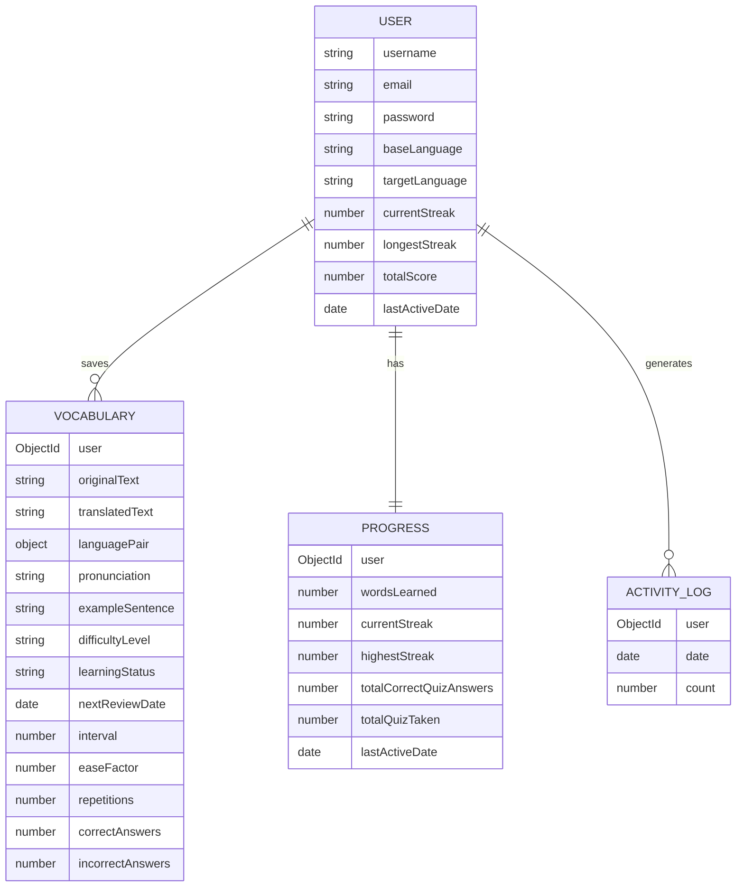

<p align="center">
  
  
  
  
  
</p>

# 🌍 LingoTrack — AI-Powered Language Learning Platform

**LingoTrack** is a full-stack, AI-driven language learning application that combines real-time translation, voice interaction, spaced repetition, and gamified quizzes into one seamless experience. Built with the MERN stack and integrated with OpenAI's GPT API for context-aware translations.

> _"Learn smarter, not harder — with AI as your personal language tutor."_

---

## ✨ Key Features

| Feature | Description |
|---|---|
| 🤖 **AI-Powered Translation** | Context-aware translations using OpenAI (Grok) with pronunciation, difficulty level, example sentences, and grammatical explanations. Falls back to MyMemory API when credits are exhausted. |
| 🎙️ **Voice-to-Voice Learning** | Speak in your native language using the Web Speech API (STT), get an AI translation, and hear the result via Google TTS — a full voice-to-voice loop. |
| 📚 **Smart Vocabulary Bank** | Save translated words to a personal vocabulary with status tracking (`new` → `learning` → `mastered`). |
| 🧠 **Spaced Repetition (SM-2)** | Words are scheduled for review using the SuperMemo-2 algorithm, optimizing long-term retention by adjusting review intervals based on performance. |
| 🎯 **Adaptive Quizzes** | Quizzes are generated from words due for SRS review. After answering, users rate difficulty (`Easy` / `Hard`), which feeds back into the SM-2 algorithm to adjust future scheduling. |
| 📊 **Learning Dashboard** | Visualize your 7-day activity, current streak, longest streak, words mastered, and total score with interactive Recharts graphs. |
| 🌙 **Dark / Light Mode** | Fully themed UI with persistent preference stored in `localStorage`. |
| 🔐 **JWT Authentication** | Secure user registration, login, and session persistence with bcrypt password hashing and Bearer token authorization. |
| 🌐 **11 Language Support** | English, Spanish, French, German, Italian, Japanese, Korean, Chinese, Portuguese, Russian, and Hindi. |

---

## 🏗️ System Architecture

```
┌─────────────────────────────────────────────────────────┐
│                       FRONTEND                          │
│              React 19 + Vite + TailwindCSS              │
│                                                         │
│  ┌──────────┐ ┌──────────┐ ┌───────┐ ┌──────┐ ┌──────┐ │
│  │Dashboard │ │Translator│ │ Vocab │ │ Quiz │ │Profile│ │
│  └────┬─────┘ └────┬─────┘ └───┬───┘ └──┬───┘ └──┬───┘ │
│       │            │           │        │        │      │
│  ┌────┴────────────┴───────────┴────────┴────────┴───┐  │
│  │          Context Providers (Auth/Theme/Settings)   │  │
│  └────────────────────────┬──────────────────────────┘  │
│                           │ Axios (JWT Bearer Token)    │
└───────────────────────────┼─────────────────────────────┘
                            │  REST API
┌───────────────────────────┼─────────────────────────────┐
│                       BACKEND                           │
│              Node.js + Express 5                        │
│                                                         │
│  ┌──────────────────────────────────────────────────┐   │
│  │              Middleware (JWT Auth)                │   │
│  └──────────────────────┬───────────────────────────┘   │
│                         │                               │
│  ┌─────────┐ ┌──────────┤ ┌──────────┐ ┌────────────┐  │
│  │  Auth   │ │Translation│ │Vocabulary│ │Quiz + SRS  │  │
│  │Controller│ │Controller│ │Controller│ │Controller  │  │
│  └────┬────┘ └────┬─────┘ └────┬─────┘ └─────┬──────┘  │
│       │           │            │              │         │
│  ┌────┴───┐ ┌─────┴─────┐ ┌───┴────┐  ┌──────┴──────┐  │
│  │  User  │ │  OpenAI   │ │Vocabulary│ │  Progress   │  │
│  │ Model  │ │  Service  │ │  Model  │ │ActivityLog  │  │
│  └────┬───┘ └───────────┘ └───┬────┘  └──────┬──────┘  │
│       └─────────┬─────────────┴───────────────┘         │
│                 │                                       │
│          ┌──────┴──────┐                                │
│          │  MongoDB    │                                │
│          │  (Atlas)    │                                │
│          └─────────────┘                                │
└─────────────────────────────────────────────────────────┘
```

---

## 📁 Project Structure

```
lingotrack/
├── backend/
│   ├── server.js                  # Express app entry point
│   ├── package.json
│   ├── .env.example               # Environment variable template
│   └── src/
│       ├── config/
│       │   └── db.js              # MongoDB connection via Mongoose
│       ├── middleware/
│       │   └── auth.js            # JWT verification middleware
│       ├── models/
│       │   ├── User.js            # User schema (bcrypt, streaks, score)
│       │   ├── Vocabulary.js      # Vocab schema (SM-2 fields, stats)
│       │   ├── Progress.js        # Aggregate progress per user
│       │   └── ActivityLog.js     # Daily word-count log for charts
│       ├── controllers/
│       │   ├── authController.js          # Register, Login, Profile
│       │   ├── translationController.js   # AI translation orchestration
│       │   ├── vocabularyController.js    # CRUD + weak-word detection
│       │   ├── quizController.js          # Quiz generation + SM-2 scoring
│       │   └── progressController.js      # Stats aggregation + streaks
│       ├── routes/
│       │   ├── authRoutes.js
│       │   ├── translationRoutes.js
│       │   ├── vocabularyRoutes.js
│       │   ├── quizRoutes.js
│       │   ├── progressRoutes.js
│       │   └── ttsRoutes.js       # Google TTS proxy (bypasses CORS)
│       ├── services/
│       │   └── openaiService.js   # OpenAI + MyMemory + Mock fallback
│       └── utils/
│           └── srs.js             # SuperMemo-2 algorithm implementation
│
├── frontend/
│   ├── index.html
│   ├── vite.config.js
│   ├── tailwind.config.js
│   ├── package.json
│   └── src/
│       ├── main.jsx               # App bootstrap with providers
│       ├── App.jsx                # Routing + protected routes
│       ├── index.css              # Global styles + theme tokens
│       ├── constants/
│       │   └── languages.js       # Supported languages + BCP-47 tags
│       ├── context/
│       │   ├── AuthContext.jsx    # JWT auth state management
│       │   ├── ThemeContext.jsx   # Dark/Light mode toggle
│       │   └── SettingsContext.jsx # TTS speed, pitch, autoplay prefs
│       ├── hooks/
│       │   ├── useSpeechToText.js # Web Speech Recognition hook
│       │   └── useTextToSpeech.js # Google TTS → Web Speech fallback
│       ├── components/
│       │   ├── Navbar.jsx         # Navigation with active states
│       │   └── AnimationUtils.jsx # Framer Motion reusable wrappers
│       ├── pages/
│       │   ├── Login.jsx          # Auth page (Login + Register)
│       │   ├── Dashboard.jsx      # Stats overview + activity chart
│       │   ├── Translator.jsx     # AI translation + voice I/O
│       │   ├── Vocabulary.jsx     # Saved words management
│       │   ├── Quiz.jsx           # SRS-based quiz with SM-2 feedback
│       │   └── Profile.jsx        # Language settings + user stats
│       └── services/
│           └── api.js             # Axios instance with JWT interceptor
│
└── README.md
```

---

## 🧠 Spaced Repetition System (SM-2)

LingoTrack implements the **SuperMemo-2 (SM-2)** algorithm to optimize vocabulary retention. Each word tracks:

| Field | Purpose |
|---|---|
| `interval` | Days until next review |
| `easeFactor` | Difficulty multiplier (starts at 2.5) |
| `repetitions` | Consecutive correct answers |
| `nextReviewDate` | Exact date the word is due |

**How it works:**
1. After each quiz answer, the user rates difficulty: **Easy** (quality=5) or **Hard** (quality=3). Wrong answers get quality=1.
2. The SM-2 formula recalculates the `easeFactor`, `interval`, and `nextReviewDate`.
3. Words answered correctly get progressively longer intervals (1 → 6 → 15 → 38 days...).
4. Wrong answers reset the word to `interval=1`, ensuring it comes back immediately.

---

## 🔌 API Reference

### Authentication
| Method | Endpoint | Description | Auth |
|--------|----------|-------------|------|
| `POST` | `/api/auth/register` | Create new account | ❌ |
| `POST` | `/api/auth/login` | Login & get JWT | ❌ |
| `GET` | `/api/auth/me` | Get current user | ✅ |
| `PUT` | `/api/auth/profile` | Update username/languages | ✅ |

### Translation
| Method | Endpoint | Description | Auth |
|--------|----------|-------------|------|
| `POST` | `/api/translation` | Translate text (AI-powered) | ✅ |

### Vocabulary
| Method | Endpoint | Description | Auth |
|--------|----------|-------------|------|
| `GET` | `/api/vocabulary` | Get all saved words | ✅ |
| `POST` | `/api/vocabulary` | Save a new word | ✅ |
| `PUT` | `/api/vocabulary/:id` | Update learning status | ✅ |
| `DELETE` | `/api/vocabulary/:id` | Delete a word | ✅ |
| `GET` | `/api/vocabulary/weak` | Get words with <70% accuracy | ✅ |

### Quiz
| Method | Endpoint | Description | Auth |
|--------|----------|-------------|------|
| `GET` | `/api/quiz/generate` | Generate quiz from SRS-due words | ✅ |
| `POST` | `/api/quiz/submit` | Submit answers & update SM-2 | ✅ |

### Progress
| Method | Endpoint | Description | Auth |
|--------|----------|-------------|------|
| `GET` | `/api/progress` | Dashboard stats + 7-day chart | ✅ |
| `POST` | `/api/progress/quiz` | Record quiz completion | ✅ |

### Audio
| Method | Endpoint | Description | Auth |
|--------|----------|-------------|------|
| `GET` | `/api/tts?text=...&lang=...` | Google TTS proxy (audio stream) | ❌ |

---

## 🚀 Getting Started

### Prerequisites
- **Node.js** v18+
- **MongoDB** (local or [Atlas](https://www.mongodb.com/cloud/atlas))
- **OpenAI / Grok API Key** (optional — app falls back to free translation)

### 1. Clone the Repository
```bash
git clone https://github.com/pankajyadav2006/lingotrack.git
cd lingotrack
```

### 2. Backend Setup
```bash
cd backend
npm install
```

Create a `.env` file based on the template:
```bash
cp .env.example .env
```

Configure your environment variables:
```env
PORT=5050
MONGODB_URI=mongodb+srv://<user>:<password>@cluster0.xxxxx.mongodb.net/lingotrack
JWT_SECRET=your_super_secret_jwt_key
GROK_API_KEY=your_api_key_here
FRONTEND_URL=http://localhost:5173
```

Start the backend:
```bash
npm run dev
```

### 3. Frontend Setup
```bash
cd ../frontend
npm install
npm run dev
```

The app will be available at **http://localhost:5173**

---

## 🌐 Deployment

| Service | Platform | URL |
|---------|----------|-----|
| Backend API | [Render](https://render.com) | `https://lingotrack.onrender.com` |
| Frontend | [Vercel](https://vercel.com) | `https://lingotrack.vercel.app` |
| Database | [MongoDB Atlas](https://cloud.mongodb.com) | Cloud Cluster |

### Deploy Backend (Render)
1. Connect your GitHub repo on Render
2. **Root Directory:** `backend`
3. **Build Command:** `npm install`
4. **Start Command:** `node server.js`
5. Add environment variables from `.env`

### Deploy Frontend (Vercel)
1. Import repo on Vercel
2. **Root Directory:** `frontend`
3. **Build Command:** `npm run build`
4. **Output Directory:** `dist`
5. Add env: `VITE_API_BASE_URL=https://your-backend.onrender.com/api`

---

## 🛠️ Tech Stack

### Frontend
| Technology | Purpose |
|---|---|
| React 19 | UI framework |
| Vite 8 | Build tool & dev server |
| TailwindCSS 3 | Utility-first styling |
| Framer Motion | Page transitions & micro-animations |
| Recharts | Dashboard activity charts |
| Lucide React | Icon library |
| React Router 7 | Client-side routing |
| Web Speech API | Speech-to-Text & Text-to-Speech |

### Backend
| Technology | Purpose |
|---|---|
| Node.js 22 | Runtime |
| Express 5 | HTTP framework |
| Mongoose 9 | MongoDB ODM |
| JSON Web Token | Stateless authentication |
| bcryptjs | Password hashing |
| OpenAI SDK | AI-powered translations |
| Axios | HTTP client (MyMemory fallback + TTS proxy) |

---

## 📊 Database Schema



---

## 🤝 Contributing

1. Fork the repository
2. Create a feature branch (`git checkout -b feature/amazing-feature`)
3. Commit your changes (`git commit -m 'Add amazing feature'`)
4. Push to the branch (`git push origin feature/amazing-feature`)
5. Open a Pull Request

---

## 📄 License

This project is licensed under the **ISC License**.

---

<p align="center">
  <b>Built with ❤️ by <a href="https://github.com/pankajyadav2006">Pankaj Yadav</a></b>
</p>
